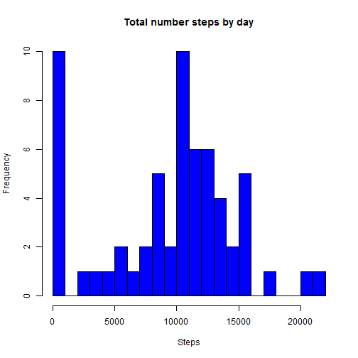
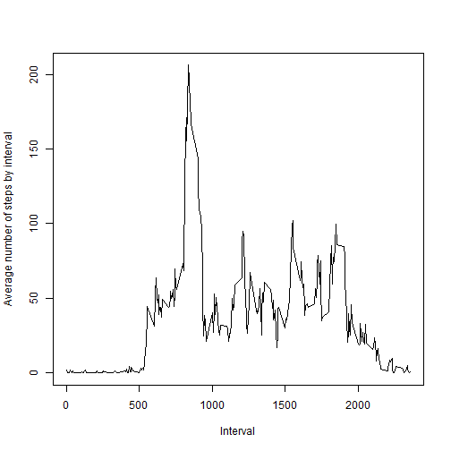
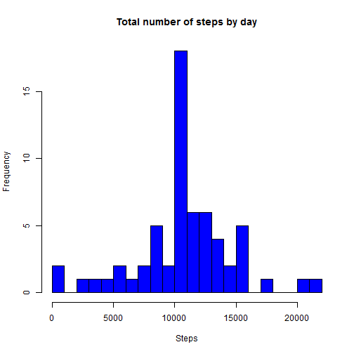

##Introduction

It is now possible to collect a large amount of data about personal movement using activity monitoring devices such as a Fitbit, Nike Fuelband, or Jawbone Up. These type of devices are part of the "quantified self" movement -- a group of enthusiasts who take measurements about themselves regularly to improve their health, to find patterns in their behavior, or because they are tech geeks. But these data remain under-utilized both because the raw data are hard to obtain and there is a lack of statistical methods and software for processing and interpreting the data.

This assignment makes use of data from a personal activity monitoring device. This device collects data at 5 minute intervals through out the day. The data consists of two months of data from an anonymous individual collected during the months of October and November, 2012 and include the number of steps taken in 5 minute intervals each day.

##Data

The data for this assignment can be downloaded from the course web site:

Dataset: Activity monitoring data [52K]
The variables included in this dataset are:

steps: Number of steps taking in a 5-minute interval (missing values are coded as NA)

date: The date on which the measurement was taken in YYYY-MM-DD format

interval: Identifier for the 5-minute interval in which measurement was taken

The dataset is stored in a comma-separated-value (CSV) file and there are a total of 17,568 observations in this dataset.

##Assignment

This assignment will be described in multiple parts. You will need to write a report that answers the questions detailed below. Ultimately, you will need to complete the entire assignment in a single R markdown document that can be processed by knitr and be transformed into an HTML file.

Throughout your report make sure you always include the code that you used to generate the output you present. When writing code chunks in the R markdown document, always use echo = TRUE so that someone else will be able to read the code. This assignment will be evaluated via peer assessment so it is essential that your peer evaluators be able to review the code for your analysis.

For the plotting aspects of this assignment, feel free to use any plotting system in R (i.e., base, lattice, ggplot2)

Fork/clone the GitHub repository created for this assignment. You will submit this assignment by pushing your completed files into your forked repository on GitHub. The assignment submission will consist of the URL to your GitHub repository and the SHA-1 commit ID for your repository state.

NOTE: The GitHub repository also contains the dataset for the assignment so you do not have to download the data separately.

## Loading and Processing the Data


```r
setwd("C:/Users/Debby/Documents/GitHub/ReproducibleResearch_Project1")
library(data.table)
```

```
## Warning: package 'data.table' was built under R version 3.1.3
```

```
## data.table 1.9.4  For help type: ?data.table
## *** NB: by=.EACHI is now explicit. See README to restore previous behaviour.
```

```r
data_zip_file  <- "repdata-data-activity.zip"
data_text_file <- "activity.csv"
columnClasses <- c("numeric","Date","integer") 
df_activity <- read.csv(unz(data_zip_file, data_text_file), header = TRUE, sep = ",", colClasses=columnClasses, na.strings="NA")
dt_activity <- as.data.table(df_activity)
```

##Number of Steps by day
###What is mean total number of steps taken per day?

For this part of the assignment, you can ignore the missing values in the dataset.

1 - Calculate the total number of steps taken per day

2 - If you do not understand the difference between a histogram and a barplot, research the difference between them.
Make a histogram of the total number of steps taken each day


Note that the `echo = FALSE` parameter was added to the code chunk to prevent printing of the R code 
that generated the plot.


 

3 - Calculate and report the mean and median of the total number of steps taken per day


```r
mean_steps   <- mean(daily_avg)
mean_steps
```

```
## [1] 9354.23
```

```r
median_steps <- median(daily_avg)
median_steps
```

```
## [1] 10395
```

##What is the average daily activity pattern?

1 - Make a time series plot (i.e. type = "l") of the 5-minute interval (x-axis) and the average number of steps
taken, averaged across all days (y-axis)

 

2 - Which 5-minute interval, on average across all the days in the dataset, contains the maximum number of steps?

max_interval contains the 5-minutes interval with the highest average number of steps


```r
max_steps_interval   <- max(dt_temp$average_steps)
max_interval <- dt_temp[average_steps==max_steps_interval,interval]
max_interval
```

```
## [1] 835
```

##Imputing missing values

Note that there are a number of days/intervals where there are missing values (coded as NA). 
The presence of missing days may introduce bias into some calculations or summaries of the data.

1 - Calculate and report the total number of missing values in the dataset (i.e. the total number of rows with NAs)


```r
num_na <- sum( is.na( dt_activity$steps ) ) #Only steps contain NA's values
num_na
```

```
## [1] 2304
```

2 - Devise a strategy for filling in all of the missing values in the dataset. 
The strategy does not need to be sophisticated. For example, you could use the mean/median for that day,
or the mean for that 5-minute interval, etc
3 - Create a new dataset that is equal to the original dataset but with the missing data filled in

```r
dt_activity_complete <- copy(dt_activity)
dt_activity_complete[is.na(steps)]$steps <- with(dt_activity, 
                                             ave(steps, interval, 
                                                 FUN = function(x) mean(x, na.rm = TRUE)))[is.na(dt_activity_complete$steps)]
```

4 - Make a histogram of the total number of steps taken each day and Calculate and report the mean and median 
total number of steps taken per day. 
Do these values differ from the estimates from the first part of the assignment? 
What is the impact of imputing missing data on the estimates of the total daily number of steps?


```r
daily_avg = dt_activity_complete[,list(daily_steps=sum(steps,na.rm = TRUE)),by=date]$daily_steps
hist(
        x=daily_avg, 
        breaks=20,
        col="blue",
        xlab="Steps",
        ylab = "Frequency",
        main= "Total number of steps by day"     
)
```

 

```r
mean_steps   <- mean(daily_avg)
mean_steps
```

```
## [1] 10766.19
```

```r
median_steps <- median(daily_avg)
median_steps
```

```
## [1] 10766.19
```

The histogram is different because the 
The mean and median values are higher after imputing missing data. 
The reason is that in the original data, there are some days which have values NA for any interval. 
The total number of steps taken in such days are set to 0s by default in the first calculation. 
After replacing missing steps with the mean steps of associated interval value, these 0 values are removed 
from the histogram of total number of steps.

##Are there differences in activity patterns between weekdays and weekends?

For this part the weekdays() function may be of some help here. Use the dataset with the filled-in missing values for this part.

1 - Create a new factor variable in the dataset with two levels - "weekday" and "weekend" indicating 
whether a given date is a weekday or weekend day.

2 - Make a panel plot containing a time series plot (i.e. type = "l") of the 5-minute interval (x-axis) and the
average number of steps taken, averaged across all weekday days or weekend days (y-axis)


```r
library(lattice) 
is_weekend_day <- weekdays(dt_activity_complete$date) %in% c("Sunday","Saturday")
dt_activity_complete[, day_type := ifelse(is_weekend_day, "weekend", "weekday")]
```

```
##            steps       date interval day_type
##     1: 1.7169811 2012-10-01        0  weekday
##     2: 0.3396226 2012-10-01        5  weekday
##     3: 0.1320755 2012-10-01       10  weekday
##     4: 0.1509434 2012-10-01       15  weekday
##     5: 0.0754717 2012-10-01       20  weekday
##    ---                                       
## 17564: 4.6981132 2012-11-30     2335  weekday
## 17565: 3.3018868 2012-11-30     2340  weekday
## 17566: 0.6415094 2012-11-30     2345  weekday
## 17567: 0.2264151 2012-11-30     2350  weekday
## 17568: 1.0754717 2012-11-30     2355  weekday
```

```r
dt_temp_complete = dt_activity_complete[,list(avg_steps=mean(steps,na.rm = TRUE)),by=list(interval,day_type)]
with(dt_temp_complete, xyplot(avg_steps ~ interval | day_type, layout = c(1, 2), type='l',xlab='Interval',ylab="Number of steps"))
```

 

There seems to be some difference at the start of the day.  This could be because people tend to start their day 
at a later time.
